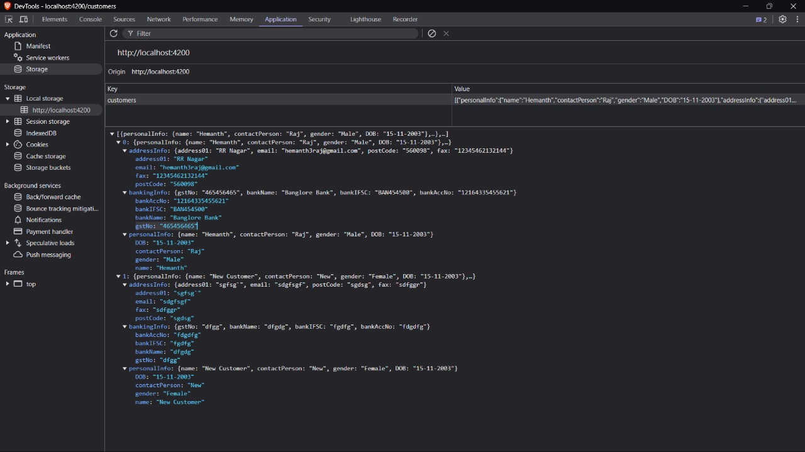

# Assignment

## Login Page in action

## Customers personal info

## Customers Address Info

## Customers Banking Info

## Local Storage

## Further help

To get more help on the Angular CLI use `ng help` or go check out the [Angular CLI Overview and Command Reference](https://angular.io/cli) page.
